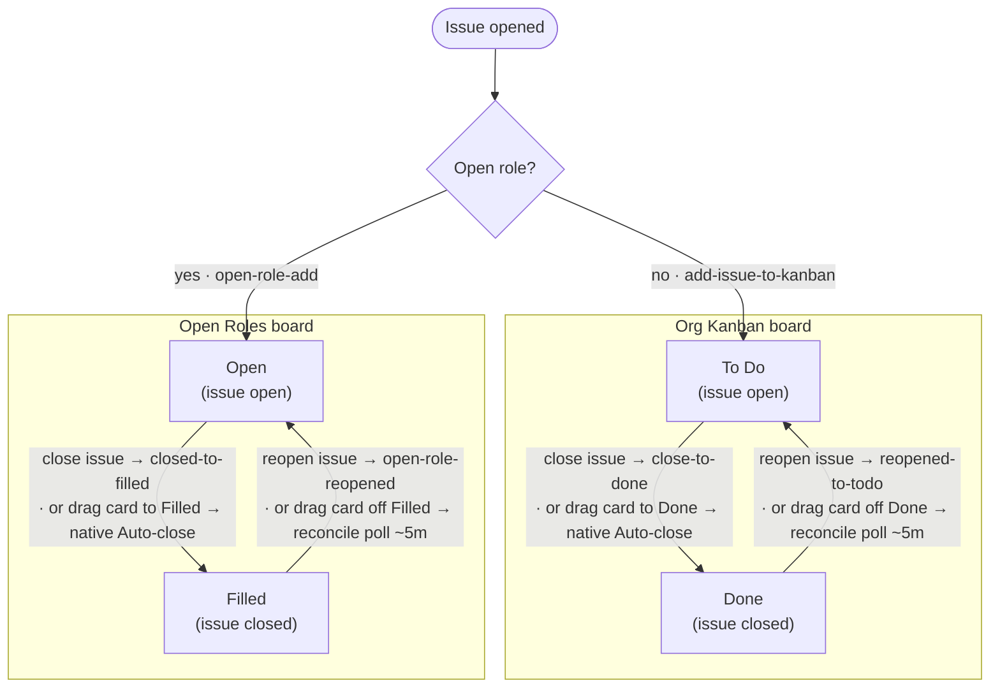

# Open Austin Org Tooling
This repo contains tools, documentation, and automation for managing the [Open Austin](https://www.open-austin.org/) GitHub organization.

**Purpose:** Keep our issue tracker, project boards, labels, and documentation in sync with the org's current structure and priorities.

## Quick Start
### For Contributors
See [CONTRIBUTING.md](CONTRIBUTING.md) for setup instructions (GitHub CLI, auth, spike workflow).

### For Agents
See [AGENTS.md](AGENTS.md) or [CLAUDE.md](CLAUDE.md) for rules, boundaries, and write safety requirements.

## Sync Tools
The sync tools pull current org state into local markdown snapshots. This gives you (or an agent) full context without repeated API calls.

**Run the sync:**

```bash
tools/sync/run.sh
```

**Output:**
- `snapshot/issues.md` — all open issues grouped by team label
- `snapshot/labels.md` — current label taxonomy
- `snapshot/board-org-kanban.md` — Org Kanban project board
- `snapshot/board-open-roles.md` — Open Roles project board

**Snapshots are gitignored** — always regenerate them at the start of a work session.

## Write Operations
Guarded writes (label changes, issue closes, board moves) happen two ways: the **board-automation workflows** described below, and the **`gh` CLI** directly for ad-hoc changes — see [AGENTS.md](AGENTS.md) for the command patterns and safety rules. There is no separate Python write-tool layer; the early plan for one (now at `docs/archive/github-tooling.todo.md`) was set aside in favor of workflows + `gh`.

All write operations follow the write-safety rules: dry-run first where supported, and explicit approval before anything that mutates shared org state.

## Board Automation
GitHub Actions in [`.github/workflows/`](.github/workflows/) keep issue state and the two project boards (Org Kanban, Open Roles) in sync, so closing/reopening an issue and moving a board card stay consistent without manual bookkeeping. **Almost everything is custom Actions in this repo** — with exactly **one deliberate exception**: the native Projects "Auto-close issue" workflow (see below). All other native Projects workflows are intentionally turned **off**, so code is the single source of truth.

A tracked issue has one continuous lifecycle: it's **opened**, routed once (by whether it carries the `open role` label) to one board, and then cycles between an open state and a closed state on that board. Each cycle transition can be driven from **either side** — act on the issue, or move the card — and they stay in sync.



Everything on the issue side (open / close / reopen) and the native card→close is **immediate**. The one lagging path is **card → reopen** (dragging a card out of Done/Filled): it's the single scheduled job (`board-reopen-reconcile`), and **GitHub's scheduled runs are best-effort, often delayed 10–30+ minutes** (the first run after enabling is slowest) — so reopening the *issue* directly is the instant option. That reconciler is the one exception to "immediate"; the one exception to "in the repo" is the native `Auto-close issue` workflow (card→close), which is configured in the Projects UI and has no workflow file. A fresh-close guard keeps the reconciler from resurrecting issues closed before this automation existed (it skips anything closed in the last 10 minutes; a one-time cleanup tool used during rollout confirmed the boards were already consistent and has since been removed).

**Routing is right-the-first-time — no board is wastefully double-touched.** An open-role issue created via the form goes straight to Open Roles and never lands on the Kanban. The *only* time anything is removed from a board is **reclassification**: a plain issue that landed on the Kanban is *later* labeled `open role`, so `open-role-add` moves it to Open Roles and clears the now-stale Kanban card. Separately, `label-open-role-from-form` reads the open-role form's team dropdown and applies the team label(s).

**Scheduled maintenance & reporting** (separate from the sync loop above):

| Workflow | Cadence | Purpose |
|---|---|---|
| `archive-old-done` | weekly | Archive Org Kanban `Done` items older than 180 days |
| `archive-old-filled` | weekly | Archive Open Roles `Filled` items older than 1 year |
| `stale-role-warning` | weekly | Comment on open roles with no update in 90+ days |
| `role-pipeline-report` | monthly (1st Monday) | Post the Open Roles pipeline snapshot to `#t-engagement` |

Per-team weekly issue summaries to Slack are handled separately by the [`weekly-org-summary`](skills/weekly-org-summary/SKILL.md) skill, not by these Actions.

## Documentation
- **Active spikes:** `docs/active-spikes/` — current work with accompanying `.todo.md` files
- **Decisions:** `docs/decisions/` — settled architectural choices
- **Pinned issues:** `docs/pinned-issues.md` — unresolved org/tooling/process questions intentionally preserved for later
- **Future ideas:** `docs/scratch/future-ideas.md` — conceptual someday material that is not active work
- **Misc intake:** `docs/scratch/misc.md` — raw observed friction and issue intake
- **Scratch:** `docs/scratch/` — exploratory drafts
- **Archive:** `docs/archive/` — historical context

See [skills/run-project-spike/SKILL.md](skills/run-project-spike/SKILL.md) for the full workflow, and [skills/](skills/) for the repo's other agent-assisted workflows.
