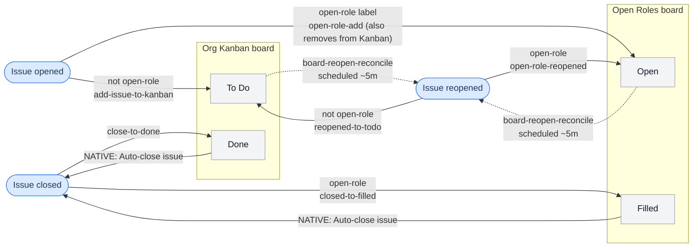

# Open Austin Org Tooling
This repo contains tools, documentation, and automation for managing the [Open Austin](https://www.open-austin.org/) GitHub organization.

**Purpose:** Keep our issue tracker, project boards, labels, and documentation in sync with the org's current structure and priorities.

## Quick Start
### For Contributors
See [CONTRIBUTING.md](CONTRIBUTING.md) for setup instructions (GitHub CLI, auth, spike workflow).

### For Agents
See [AGENTS.md](AGENTS.md) or [CLAUDE.md](CLAUDE.md) for rules, boundaries, and write safety requirements.

## Sync Tools
The sync tools pull current org state into local markdown snapshots. This gives you (or an agent) full context without repeated API calls.

**Run the sync:**

```bash
tools/sync/run.sh
```

**Output:**
- `snapshot/issues.md` — all open issues grouped by team label
- `snapshot/labels.md` — current label taxonomy
- `snapshot/board-org-kanban.md` — Org Kanban project board
- `snapshot/board-open-roles.md` — Open Roles project board

**Snapshots are gitignored** — always regenerate them at the start of a work session.

## Write Tools
Write tools for guarded mutations (label changes, issue closes, board moves) are in active development. See `docs/github-tooling.todo.md` for status.

All write operations require `--dry-run` by default and explicit approval before execution.

## Board Automation
GitHub Actions in [`.github/workflows/`](.github/workflows/) keep issue state and the two project boards (Org Kanban, Open Roles) in sync, so closing/reopening an issue and moving a board card stay consistent without manual bookkeeping. **Almost everything is custom Actions in this repo** — with exactly **one deliberate exception**: the native Projects "Auto-close issue" workflow (see below). All other native Projects workflows are intentionally turned **off**, so code is the single source of truth.

Issue events (`opened`, `closed`, `reopened`, `labeled`) are real repository events and drive the board **immediately** in code. The reverse direction — a board card move driving the issue — is **not** available as a repo-level trigger (`projects_v2_item` is an org-level event that never reaches a repo workflow; see [`docs/decisions/0004-projects-v2-automation-triggers.md`](docs/decisions/0004-projects-v2-automation-triggers.md)). That direction splits in two:
- **Card → close** (Done/Filled): the native **`Auto-close issue`** workflow, configured in each Project's Workflows UI. Instant. **This is the one piece of board logic not in the repo** — it has no workflow file. Documented in [`docs/decisions/0005-board-sync-architecture.md`](docs/decisions/0005-board-sync-architecture.md).
- **Card → reopen**: has no native equivalent and no immediate path, so it is the single scheduled reconciliation job (`board-reopen-reconcile`, every ~5 min).



Solid arrows are immediate (event-driven code, or the one native close); the **dotted arrow is the single ~5-minute polling job**, so reopening via a board move can lag a few minutes (reopening the issue directly is immediate). Two more custom Actions run on labels: `label-open-role-from-form` reads the open-role issue-form dropdown and applies the team label(s), and `open-role-add` routes newly-labeled open roles and sets their initial status. A one-time `baseline-terminal-cleanup` job (manual) is run once before the reopen reconciler's schedule is enabled, so the reconciler never resurrects issues closed before this automation existed.

**Scheduled maintenance & reporting** (separate from the sync loop above):

| Workflow | Cadence | Purpose |
|---|---|---|
| `archive-old-done` | weekly | Archive Org Kanban `Done` items older than 180 days |
| `archive-old-filled` | weekly | Archive Open Roles `Filled` items older than 1 year |
| `stale-role-warning` | weekly | Comment on open roles with no update in 90+ days |
| `role-pipeline-report` | monthly (1st Monday) | Post the Open Roles pipeline snapshot to `#t-engagement` |

Per-team weekly issue summaries to Slack are handled separately by the [`weekly-org-summary`](skills/weekly-org-summary/SKILL.md) skill, not by these Actions.

## Documentation
- **Active spikes:** `docs/active-spikes/` — current work with accompanying `.todo.md` files
- **Decisions:** `docs/decisions/` — settled architectural choices
- **Scratch:** `docs/scratch/` — exploratory drafts
- **Archive:** `docs/archive/` — historical context

See [skills/run-project-spike/SKILL.md](skills/run-project-spike/SKILL.md) for the full workflow, and [skills/](skills/) for the repo's other agent-assisted workflows.
